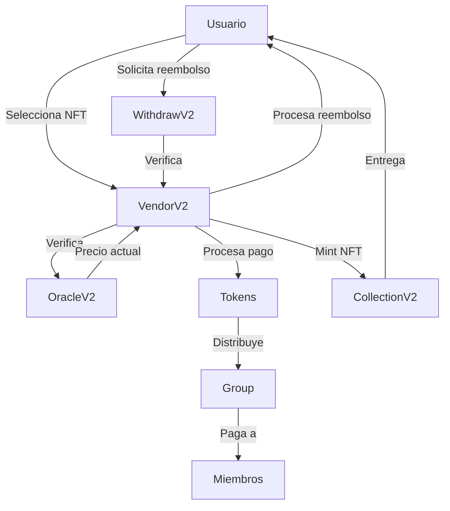

# INHABIT Vendor NFT - Plataforma de Venta de NFTs

## 📑 Índice General

### 1. [Descripción General](#descripcion-general)

### 2. [Características Principales](#caracteristicas-principales)

### 3. [Flujo del Sistema](#flujo-sistema)

- [Diagrama de Flujo](#diagrama-flujo)
- [Roles y Responsabilidades](#roles-responsabilidades)
- [Proceso de Compra](#proceso-compra)
- [Proceso de Reembolso](#proceso-reembolso)

### 4. [Guía de Configuración del Sistema](#guia-configuracion)

- [Configuración Inicial](#configuracion-inicial)
- [Configuración de Tokens](#configuracion-tokens)
- [Configuración de Colecciones](#configuracion-colecciones)
- [Configuración de Grupos](#configuracion-grupos)
- [Configuración de Reembolsos](#configuracion-reembolsos)
- [Operaciones del Sistema](#operaciones-sistema)

### 5. [Configuración Técnica](#configuracion-tecnica)

- [Requisitos](#requisitos)
- [Instalación](#instalacion)
- [Despliegue](#despliegue)

### 6. [Configuración de Tokens y Oracles](#configuracion-tokens-oracles)

- [Tokens Disponibles en Celo](#tokens-disponibles-celo)
- [Oracles de Chainlink](#oracles-chainlink)
- [Proceso de Configuración](#proceso-configuracion)
- [Consideraciones Importantes](#consideraciones-importantes)

### 7. [Configuración de Grupos](#configuracion-grupos)

- [Estructura de Grupos](#estructura-grupos)
- [Creación de Grupos](#creacion-grupos)
- [Gestión de Miembros](#gestion-miembros)
- [Distribución de Fondos](#distribucion-fondos)
- [Ejemplos Prácticos](#ejemplos-practicos)

### 8. [Seguridad](#seguridad)

### 9. [Testing](#testing)

### 10. [Documentación Técnica de Contratos](#documentacion-tecnica)

- [VendorV2.sol](#vendorv2)
- [CollectionV2.sol](#collectionv2)
- [OracleV2.sol](#oraclev2)
- [Group.sol](#group)
- [Administered.sol](#administered)
- [WithdrawV2.sol](#withdrawv2)

### 11. [Contribución](#contribucion)

### 12. [Licencia](#licencia)

### 13. [Contacto](#contacto)

## 📋 <a id="descripcion-general"></a>Descripción General

INHABIT Vendor NFT es una plataforma descentralizada que permite la venta de NFTs de múltiples colecciones, aceptando pagos en diferentes tokens ERC20 y tokens nativos (como ETH, MATIC, CELO). La plataforma incluye funcionalidades avanzadas como distribución de ingresos, sistema de reembolsos y gestión de roles.

## 🚀 <a id="caracteristicas-principales"></a>Características Principales

- **Venta de NFTs**: Compra de NFTs de diferentes colecciones
- **Múltiples Métodos de Pago**: Acepta tokens ERC20 y tokens nativos
- **Sistema de Reembolsos**: Opción de devolución de NFTs con reembolso
- **Distribución de Ingresos**: Reparto automático de ganancias entre grupos
- **Gestión de Roles**: Sistema de permisos para administradores y usuarios
- **Oracles de Precios**: Integración con Chainlink para precios en tiempo real

## 📊 <a id="flujo-sistema"></a>Flujo del Sistema

### 1. Diagrama de Flujo General



### 2. Roles y Responsabilidades

#### 2.1 Administrador

- Configurar sistema
- Gestionar colecciones
- Monitorear operaciones
- Resolver problemas

#### 2.2 Usuario

- Comprar NFTs
- Solicitar reembolsos
- Verificar transacciones
- Reportar problemas

#### 2.3 Sistema

- Procesar pagos
- Distribuir fondos
- Gestionar NFTs
- Mantener registros

### 3. Proceso de Compra

1. **Selección**

   - Usuario elige NFT
   - Selecciona método de pago
   - Verifica precio actual

2. **Pago**

   - Aprobar gasto (ERC20)
   - Enviar fondos
   - Confirmar transacción

3. **Distribución**

   - Calcular comisiones
   - Distribuir a grupos
   - Registrar transacción

4. **Entrega**
   - Mintear NFT
   - Transferir al usuario
   - Confirmar recepción

### 4. Proceso de Reembolso

1. **Solicitud**

   - Usuario solicita reembolso
   - Verificar propiedad
   - Confirmar elegibilidad

2. **Procesamiento**

   - Calcular monto
   - Verificar fondos
   - Preparar reembolso

3. **Ejecución**
   - Devolver NFT
   - Reembolsar fondos
   - Registrar transacción

## ⚙️ <a id="guia-configuracion"></a>Guía de Configuración del Sistema

### 1. Configuración Inicial del Contrato

#### 1.1 Despliegue del Contrato

```bash
# Compilar
npx hardhat compile

# Desplegar
npx hardhat run scripts/deploy.js --network <red>
```

#### 1.2 Configuración de Roles

```solidity
// Configurar administradores
vendor.addAdmin(0x123...);  // Dirección del administrador

// Configurar usuarios
vendor.addUser(0x456...);   // Dirección del usuario
```

### 2. Configuración de Tokens

#### 2.1 Configurar Token Nativo (ETH/MATIC/CELO)

```solidity
// Ejemplo para ETH en Ethereum Mainnet
vendor.addToken(
    0xEeeeeEeeeEeEeeEeEeEeeEEEeeeeEeeeeeeeEEeE, // Dirección ETH
    0x5f4eC3Df9cbd43714FE2740f5E3616155c5b8419, // Feed ETH/USD
    8,                                           // Decimales del feed
    true,                                        // Activo
    true                                         // Es nativo
);
```

#### 2.2 Configurar Tokens ERC20

```solidity
// Ejemplo para USDC en Ethereum Mainnet
vendor.addToken(
    0xA0b86991c6218b36c1d19D4a2e9Eb0cE3606eB48, // Dirección USDC
    0x8fFfFfd4AfB6115b954Bd326cbe7B4BA576818f6, // Feed USDC/USD
    8,                                           // Decimales del feed
    true,                                        // Activo
    false                                        // No es nativo
);
```

### 3. Configuración de Colecciones NFT

#### 3.1 Añadir Nueva Colección

```solidity
// Ejemplo de configuración de colección
vendor.addCollection(
    0x123...,  // Dirección del contrato NFT
    1000000,   // Precio en USD (100.00 USD)
    true       // Activo
);
```

#### 3.2 Actualizar Colección Existente

```solidity
// Actualizar precio
vendor.updateCollection(
    0,         // ID de la colección
    1,         // Tipo: 1 = precio
    0x0,       // Dirección (no aplica)
    1500000,   // Nuevo precio (150.00 USD)
    false      // Estado (no aplica)
);
```

### 4. Configuración de Grupos

#### 4.1 Crear Grupo de Distribución

```solidity
// Estructura para miembros del grupo
Shared[] memory members = new Shared[](2);
members[0] = Shared(0x123..., 5000); // 50% para dirección 1
members[1] = Shared(0x456..., 5000); // 50% para dirección 2

// Crear grupo
vendor.addGroup(
    "team",    // Nombre del grupo
    true,      // Activo
    members    // Miembros y porcentajes
);
```

#### 4.2 Actualizar Grupo

```solidity
// Actualizar estado del grupo
vendor.updateGroupStatus("team", false);

// Añadir nuevo miembro
Shared memory newMember = Shared(0x789..., 2500);
vendor.addSharedOfGroup("team", newMember);
```

### 5. Configuración de Reembolsos

#### 5.1 Activar Sistema de Reembolsos

```solidity
// Activar globalmente
vendor.setRefundActive(true);

// Habilitar para wallet específica
vendor.setRefundEnabled(0x123..., true);
```

### 6. Operaciones del Sistema

#### 6.1 Compra de NFT

```solidity
// Compra con USDC
usdc.approve(vendorAddress, 1000000); // Aprobar gasto
vendor.buyWithToken(
    "team",      // Grupo para distribución
    usdcAddress, // Token de pago
    0,           // ID de la colección
    1            // Cantidad
);

// Compra con ETH
vendor.buyNative{value: 100000000000000000}(
    "team",      // Grupo para distribución
    0,           // ID de la colección
    ethAddress,  // Dirección ETH
    1            // Cantidad
);
```

#### 6.2 Reembolso de NFT

```solidity
// Solicitar reembolso
vendor.refundInvestment(
    0,           // ID de la colección
    usdcAddress, // Token usado
    123          // ID del NFT
);
```

#### 6.3 Monitoreo y Mantenimiento

```solidity
// Verificar estado de colección
(bool active, uint256 price) = vendor.getCollection(0);

// Verificar balance de tokens
uint256 balance = IERC20(tokenAddress).balanceOf(vendorAddress);

// Verificar precio actual
uint256 price = vendor.getUSDPrice(tokenAddress);
```

## 🔧 <a id="configuracion-tecnica"></a>Configuración Técnica

### Requisitos

- Node.js 14+
- Hardhat
- Dependencias:
  - OpenZeppelin Contracts
  - Chainlink Oracles

### Instalación

```bash
npm install
```

### Despliegue

```bash
npx hardhat run scripts/deploy.js --network <red>
```

## 🔗 <a id="configuracion-tokens-oracles"></a>Configuración de Tokens y Oracles

### 1. Tokens Disponibles en Celo

#### 1.1 Token Nativo (CELO)

```solidity
// Configuración para CELO
vendor.addToken(
    "0xEeeeeEeeeEeEeeEeEeEeeEEEeeeeEeeeeeeeEEeE", // Dirección especial para token nativo
    "0x0568fD19986748cEfF3301e55c0eb1E729E0Ab7e", // Oracle de Chainlink para CELO/USD
    8,  // Decimales del oracle
    true, // Activo
    true  // Es nativo
);
```

#### 1.2 Token ERC20 (cUSD)

```solidity
// Configuración para cUSD
vendor.addToken(
    "0x765DE816845861e75A25fCA122bb6898B8B1282a", // Dirección de cUSD
    "0xe38A27BE4E7d866327e09736F3C570F256FFd048", // Oracle de Chainlink para cUSD/USD
    8,  // Decimales del oracle
    true, // Activo
    false // No es nativo
);
```

### 2. Oracles de Chainlink en Celo

Los oráculos se obtienen de la [documentación oficial de Chainlink para la red Celo](https://docs.chain.link/data-feeds/price-feeds/addresses/?network=celo&page=1):

1. **CELO/USD**: `0x0568fD19986748cEfF3301e55c0eb1E729E0Ab7e`
2. **cUSD/USD**: `0xe38A27BE4E7d866327e09736F3C570F256FFd048`

> **Nota**: Las direcciones de los oráculos pueden cambiar. Siempre verifica la documentación oficial de Chainlink para obtener las direcciones más actualizadas.

### 3. Proceso de Configuración

1. **Preparación**:

   - Asegúrate de tener la dirección del contrato `VendorV2`
   - Tener permisos de administrador o usuario en el contrato

2. **Ejecución**:

   ```javascript
   // Ejemplo usando Hardhat
   const vendor = await ethers.getContractAt('VendorV2', VENDOR_ADDRESS)

   // Agregar token
   await vendor.addToken(
   	TOKEN_ADDRESS,
   	ORACLE_ADDRESS,
   	ORACLE_DECIMALS,
   	true, // activo
   	IS_NATIVE
   )
   ```

3. **Verificación**:
   ```javascript
   // Verificar tokens configurados
   const tokens = await vendor.tokensList()
   console.log(tokens)
   ```

### 4. Consideraciones Importantes

1. **Seguridad**:

   - Verifica que las direcciones de los oráculos sean las correctas
   - Asegúrate de que los decimales coincidan con el token
   - Verifica que el token esté activo en la red

2. **Precisión**:

   - Los oráculos de Chainlink usan 8 decimales por defecto
   - Los tokens nativos (CELO) usan 18 decimales
   - Los tokens ERC20 pueden tener diferentes decimales

3. **Mantenimiento**:
   - Monitorea los precios regularmente
   - Verifica que los oráculos estén funcionando
   - Actualiza los feeds si es necesario

## 👥 <a id="configuracion-grupos"></a>Configuración de Grupos

### Índice

1. [Estructura de Grupos](#estructura-grupos)
2. [Creación de Grupos](#creacion-grupos)
3. [Gestión de Miembros](#gestion-miembros)
4. [Distribución de Fondos](#distribucion-fondos)
5. [Ejemplos Prácticos](#ejemplos-practicos)

### 1. <a id="estructura-grupos"></a>Estructura de Grupos

El sistema de grupos está diseñado para manejar la distribución de fondos entre múltiples beneficiarios. Cada grupo tiene la siguiente estructura:

```solidity
struct GroupStruct {
    string group;      // Nombre del grupo
    bool state;        // Estado del grupo (activo/inactivo)
    Shared[] arrayShared; // Lista de miembros y sus porcentajes
}

struct Shared {
    address addr;      // Dirección del miembro
    uint256 pcng;      // Porcentaje de distribución (en base 10000)
}
```

### 2. <a id="creacion-grupos"></a>Creación de Grupos

Para crear un nuevo grupo, se utiliza la función `addGroup`:

```solidity
// Ejemplo de creación de grupo
Shared[] memory members = new Shared[](2);
members[0] = Shared(0x123..., 5000); // 50% para dirección 1
members[1] = Shared(0x456..., 5000); // 50% para dirección 2

vendor.addGroup(
    "equipo",    // Nombre del grupo
    true,        // Activo
    members      // Miembros y porcentajes
);
```

### 3. <a id="gestion-miembros"></a>Gestión de Miembros

#### 3.1 Añadir Miembro

```solidity
Shared memory newMember = Shared(0x789..., 2500);
vendor.addSharedOfGroup("equipo", newMember);
```

#### 3.2 Eliminar Miembro

```solidity
vendor.removeSharedOfGroup("equipo", 0); // Elimina el primer miembro
```

#### 3.3 Actualizar Miembro

```solidity
Shared memory updatedMember = Shared(0x789..., 3000);
vendor.updateSharedOfGroup("equipo", 2, 0, updatedMember);
```

### 4. <a id="distribucion-fondos"></a>Distribución de Fondos

La distribución de fondos se realiza automáticamente cuando se ejecuta una compra:

```solidity
// Ejemplo de distribución con token ERC20
vendor.buyWithToken(
    "equipo",      // Grupo para distribución
    usdcAddress,   // Token de pago
    0,             // ID de la colección
    1              // Cantidad
);

// Ejemplo de distribución con token nativo
vendor.buyNative{value: 100000000000000000}(
    "equipo",      // Grupo para distribución
    0,             // ID de la colección
    ethAddress,    // Dirección ETH
    1              // Cantidad
);
```

### 5. <a id="ejemplos-practicos"></a>Ejemplos Prácticos

#### 5.1 Creación de Grupo de Equipo

```solidity
// Crear grupo con 3 miembros
Shared[] memory teamMembers = new Shared[](3);
teamMembers[0] = Shared(0x123..., 4000); // 40% para fundador
teamMembers[1] = Shared(0x456..., 3000); // 30% para desarrollador
teamMembers[2] = Shared(0x789..., 3000); // 30% para diseñador

vendor.addGroup("equipo", true, teamMembers);
```

#### 5.2 Creación de Grupo de Artistas

```solidity
// Crear grupo con 2 artistas
Shared[] memory artists = new Shared[](2);
artists[0] = Shared(0xABC..., 6000); // 60% para artista principal
artists[1] = Shared(0xDEF..., 4000); // 40% para artista colaborador

vendor.addGroup("artistas", true, artists);
```

#### 5.3 Actualización de Porcentajes

```solidity
// Actualizar porcentaje de un miembro
Shared memory updatedShare = Shared(0x123..., 3500);
vendor.updateSharedOfGroup("equipo", 2, 0, updatedShare);
```

### Consideraciones Importantes

1. **Porcentajes**:

   - Los porcentajes se manejan en base 10000 (100% = 10000)
   - La suma total no debe exceder 10000

2. **Seguridad**:

   - Solo los administradores pueden gestionar grupos
   - Los grupos pueden ser activados/desactivados
   - Las direcciones deben ser válidas

3. **Distribución**:
   - Se realiza automáticamente en cada compra
   - Soporta tokens ERC20 y nativos
   - Emite eventos de distribución

## 🔒 <a id="seguridad"></a>Seguridad

- **ReentrancyGuard**: Protección contra ataques de reentrada
- **AccessControl**: Sistema de roles y permisos
- **Validaciones**: Comprobaciones de saldo y aprobaciones
- **SafeMath**: Operaciones matemáticas seguras

## 🧪 <a id="testing"></a>Testing

El proyecto incluye contratos mock para testing:

- `MockOracleV2.sol`: Simula oráculos de precios
- `MockErc20.sol`: Simula tokens ERC20

## 📚 <a id="documentacion-tecnica"></a>Documentación Técnica de Contratos

### 1. VendorV2.sol - Contrato Principal

#### Propósito General

El contrato VendorV2 actúa como una plataforma centralizada para la venta de NFTs de diversas colecciones. Permite a los usuarios comprar estos NFTs utilizando tokens ERC20 específicos o el token nativo de la blockchain (ej. ETH, MATIC, CELO).

#### Variables de Estado Principales

```solidity
mapping(address => mapping(address => uint256)) public investments;
mapping(address => bool) public refundEnabled;
bool public refundActive;
```

#### Funcionalidades Principales

- **Compra de NFTs**

  ```solidity
  function buyWithToken(
      string calldata _group,    // Grupo para distribución
      address _token,            // Token de pago
      uint256 _cIdx,            // ID de la colección
      uint256 _amount           // Cantidad a comprar
  )
  ```

  - Compra con tokens ERC20
  - Verifica saldo y aprobaciones
  - Distribuye fondos según grupo

- **Compra con Token Nativo**

  ```solidity
  function buyNative(
      string calldata _group,
      uint256 _cIdx,
      address _token,
      uint256 _amount
  ) external payable
  ```

  - Compra con ETH/MATIC/CELO
  - Maneja pagos nativos
  - Distribuye fondos

- **Sistema de Reembolsos**

  ```solidity
  function refundInvestment(
      uint256 _cIdx,    // ID de la colección
      address _token,    // Token usado en la compra
      uint256 _nftId    // ID del NFT a devolver
  )
  ```

  - Devuelve NFTs y reembolsa fondos
  - Verifica propiedad y estado
  - Maneja tokens ERC20 y nativos

- **Transferencia Reservada**
  ```solidity
  function transferReserved(
      uint256 _idx,    // ID de la colección
      address _addr,    // Dirección destino
      uint256 _qty     // Cantidad
  ) external onlyUser nonReentrant
  ```

### 2. CollectionV2.sol - Gestión de Colecciones

#### Estructuras

```solidity
struct CollectionStruct {
    address addr;    // Dirección del contrato NFT
    uint256 price;   // Precio en USD
    bool active;     // Estado de la colección
}

struct CollectionIndexStruct {
    address addr;
    uint256 index;
}
```

#### Funciones Principales

- **Gestión de Colecciones**
  ```solidity
  function addCollection(
      address _addr,    // Dirección del NFT
      uint256 _pr,      // Precio en USD
      bool _act         // Estado activo
  )
  ```
  - Añade nuevas colecciones
  - Actualiza precios y estados
  - Mantiene índice de colecciones

### 3. OracleV2.sol - Sistema de Precios

#### Estructuras

```solidity
struct ERC20List {
    address addr;    // Dirección del token
    address feed;    // Feed de precios
    bool active;     // Estado del token
    bool isNative;   // Si es token nativo
}
```

#### Funcionalidades

- **Conversión de Precios**

  ```solidity
  function parseUSDtoToken(
      uint256 _amount,    // Cantidad en USD
      address _token,     // Token destino
      bool _isNative      // Si es token nativo
  )
  ```

  - Convierte USD a tokens
  - Maneja diferentes decimales
  - Integra con Chainlink

- **Obtención de Precios**
  ```solidity
  function getUSDPrice(address _addr)
  ```
  - Obtiene precios de Chainlink
  - Verifica tokens permitidos
  - Ajusta decimales

### 4. Group.sol - Distribución de Ingresos

#### Estructuras

```solidity
struct GroupStruct {
    string group;
    bool state;
    Shared[] arrayShared;
}

struct Shared {
    address addr;
    uint256 pcng;
}
```

#### Funciones Principales

- **Gestión de Grupos**

  ```solidity
  function addGroup(
      string calldata _group,
      bool _state,
      Shared[] memory _groups
  )
  ```

  - Crea grupos de distribución
  - Asigna porcentajes
  - Gestiona miembros

- **Distribución de Fondos**
  ```solidity
  function distribution(
      string calldata _group,
      uint256 _amount,
      bool _isNative,
      address tokenAddrs
  )
  ```
  - Distribuye fondos automáticamente
  - Maneja tokens ERC20 y nativos
  - Registra eventos

### 5. Administered.sol - Control de Acceso

#### Roles y Permisos

```solidity
bytes32 public constant USER_ROLE = keccak256("USER");
```

#### Funciones Principales

- **Gestión de Roles**
  ```solidity
  function addAdmin(address account)
  function addUser(address account)
  function removeUser(address account)
  ```
  - Control de acceso granular
  - Herencia de permisos
  - Seguridad basada en roles

### 6. WithdrawV2.sol - Gestión de Retiros

#### Funciones Principales

- **Retiro de Fondos**
  ```solidity
  function withdraw(
      uint256 _amount,
      address _to
  )
  function withdrawToken(
      address _token,
      uint256 _amount,
      address _to
  )
  ```
  - Retiro de tokens nativos
  - Retiro de tokens ERC20
  - Seguridad en transacciones

## 🤝 <a id="contribucion"></a>Contribución

1. Fork del repositorio
2. Crear rama de características (`git checkout -b feature/AmazingFeature`)
3. Commit de cambios (`git commit -m 'Add some AmazingFeature'`)
4. Push a la rama (`git push origin feature/AmazingFeature`)
5. Abrir Pull Request

## 📝 <a id="licencia"></a>Licencia

Distribuido bajo la licencia MIT. Ver `LICENSE` para más información.

## 📞 <a id="contacto"></a>Contacto

Para consultas técnicas o soporte, contactar al equipo de desarrollo.
